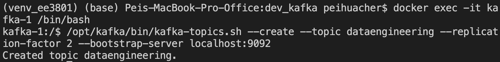
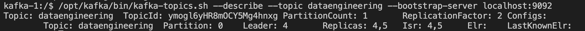
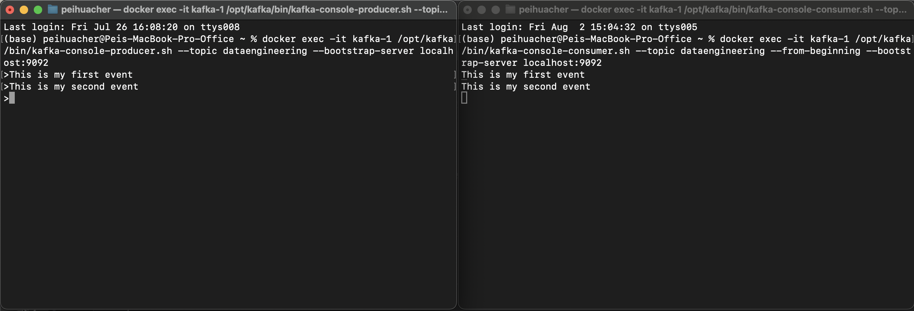

# Lab 9 Stream Data Pipeline I

- Installing Softwares
- Scenario: Streaming audio \
    Stream in audio, process and save the data for reporting.

Create a new jupyter notebook file "stream_data_pipeline_1.ipynb".


```python
import os
home_directory = os.path.expanduser("~")
os.chdir(home_directory+'/Documents/projects/ee3801')
```

# 1. Install kafka 

1. SSH into server. Go to the directory and create the following directories.

    ```$ cd ~/Documents/projects/ee3801```\
    ```$ ssh -i "MyKeyPair.pem" ec2-user@<ip_address>```\
    ```$ mkdir -p ~/dev_kafka/data```\
    ```$ cd ~/dev_kafka```

2. Download <a href="https://github.com/apache/kafka/tree/trunk/docker/examples/docker-compose-files/cluster/isolated/plaintext">docker-compose.yml</a> and save in the ```dev_kafka``` folder. 

    ```curl -LfO 'https://github.com/apache/kafka/raw/refs/heads/trunk/docker/examples/docker-compose-files/cluster/isolated/plaintext/docker-compose.yml'```

3. Open the docker-compose.yml and observe that there are 3 kafka broker with 3 isolated controllers. 

    ```sudo vi docker-compose.yml```

4. Replace the localhost to ```${PUBLIC_IP_ADDRESS}``` in the docker-compose.yml file and save the file.

2. Run the docker command in command line or terminal. Ctrl-C to terminate in the terminal and start the dev_kafka docker containers (controllers first) in docker dashboard. 

    ```IMAGE=apache/kafka:latest PUBLIC_IP_ADDRESS=<ip_address> docker-compose up```


# 2. Sending messages between producer and consumers in Kafka

1. Access docker container kafka-1 and create a new topic.

    ```docker exec -it kafka-1 /bin/bash```

    - Create a new topic \
    ```/opt/kafka/bin/kafka-topics.sh --create --topic dataengineering --replication-factor 2 --bootstrap-server localhost:9092```

        

    - Show details of the new topic created. Then exit the terminal.\
    ```/opt/kafka/bin/kafka-topics.sh --describe --topic dataengineering --bootstrap-server localhost:9092```

        

    - Run an instance in this terminal\
    ```docker exec -it kafka-1 /opt/kafka/bin/kafka-console-producer.sh --topic dataengineering --bootstrap-server localhost:9092```

2. Open a new terminal. Access the docker container kafka-1.

    - Listen to the messages send by the producer by starting a consumer. \
    ```docker exec -it kafka-1 /opt/kafka/bin/kafka-console-consumer.sh --topic dataengineering --from-beginning --bootstrap-server localhost:9092```

3. In the producer terminal, enter producer messages. You will see these messages appearing in the consumer terminal. 

    ```This is my first event```
    
    ```This is my second event```

    


4. After successfully performing the tasks above, what do you think is Apache Kafka? (Enter and submit your answer in the notebook.)


5. What are the possible examples of using Apache Kafka? (Enter and submit your answer in the notebook.)


# 3. Scenario: Streaming audio 

The company would like to build an in-house automatic speech transcribing tool. The system stream in audio from your device, transcribe it using Open AI's whisper model and save the transcribed text for reporting. 

# 3.1 Stream audio data auto-transcription

The latency of a single stream of audio data auto-transcription. Take note of the time taken to read, write and transcribe the audio.


```python
# # install python packages
# !pip install --upgrade pip

# # for mac users
# !brew install portaudio 
# !python3 -m pip install pyaudio
# !python3 -m pip install scipy

# # for mac silicon users # ensure brew is in path /opt/homebrew if not uninstall homebrew and install latest homebrew # /bin/bash -c "$(curl -fsSL https://raw.githubusercontent.com/Homebrew/install/HEAD/uninstall.sh)"
# !arch -arm64 /opt/homebrew/bin/brew install portaudio
# !python3 -m pip cache purge
# !python3 -m pip install pyaudio --global-option="build_ext" --global-option="-I/opt/homebrew/include" --global-option="-L/opt/homebrew/lib"
# !python3 -m pip install scipy

# # # for windows users
# !python3 -m pip install sounddevice
# !python3 -m pip install pyaudio
# # for GNU/Linux users
# !sudo apt install python3-pyaudio
# !python3 -m pip install scipy


```

# 3.1.1 Stream in audio 

1. Check default audio input


```python
import pyaudio

# Initialize PyAudio
p = pyaudio.PyAudio()

try:
    # Get information about the default input device
    default_input_device_info = p.get_default_input_device_info()

    # Print relevant information
    print("Default Input Microphone Information:")
    print(f"  Name: {default_input_device_info['name']}")
    print(f"  Index: {default_input_device_info['index']}")
    print(f"  Host API: {default_input_device_info['hostApi']}")
    print(f"  Max Input Channels: {default_input_device_info['maxInputChannels']}")
    print(f"  Default Sample Rate: {default_input_device_info['defaultSampleRate']}")

except OSError as e:
    print(f"Error getting default input device info: {e}")
    print("This might happen if no default input device is available or properly configured.")

finally:
    # Terminate PyAudio
    p.terminate()
```

2. List down all audio in your machine.


```python
# Testing audio setup in this device
import pyaudio
audio = pyaudio.PyAudio()
print("audio.get_device_count():",audio.get_device_count())
for i in range(audio.get_device_count()):
    print(audio.get_device_info_by_index(i))

audio.terminate()
```

3. Choose the input and output audio in your machine. Take note of the index number of the audio input or output.


```python
# This is to determine which input audio and output audio you will use.
# Explore and find the right index to use for input and output in your device.
audio = pyaudio.PyAudio()
input = audio.get_default_input_device_info()
print("Choosing my input audio: 'name':",input["name"],",'maxInputChannels':",input["maxInputChannels"],",'defaultSampleRate':",input["defaultSampleRate"])
print("Choosing my output audio:",audio.get_device_info_by_index(2))
audio.terminate()
```


```python
# If no devices are listed, the issue could be with your audio drivers or system permissions.

# for mac
# Ensure that the app has permission to use the microphone in "System Preferences" -> "Security & Privacy."

# for windows
import sounddevice as sd
print(sd.query_devices())
# Check that your microphone is enabled in the "Privacy Settings."

# for linux
# Verify that the correct ALSA/PulseAudio settings are in place.
```

# 3.1.2 Load whisper model once

1. Install OpenAI whisper


```python
# !python -m pip install -U jupyter
# !python -m pip install -U ipywidgets
# !python -m pip install -U openai-whisper
```


```python
# # python 3.11.5
# !python -m pip install -U torch
# !python -m pip uninstall numpy -y
# !python -m pip install numpy==1.26.4
# # restart kernel
```

2. Load whisper model to transcribe audio to text.


```python
import whisper
model = whisper.load_model("medium.en") # tiny.en (if disk not enough space)
```

# 3.1.3 Read from the script as you are recording

Given the script below. You can read out the script as you are recording the audio.

```
Producers are fairly straightforward – they send messages to a topic and partition, maybe request an acknowledgment, retry if a message fails – or not – and continue. Consumers, however, can be a little more complicated.

Consumers read messages from a topic. Consumers run in a poll loop that runs indefinitely waiting for messages. Consumers can read from the beginning – they will start at the first message in the topic and read the entire history. Once caught up, the consumer will wait for new messages.
```

# 3.1.4 Capture one sentence
Write Audio to file, Read Aduio from file, Transcribe, Translate

## Using pyaudio


```python
# using pyaudio

import pyaudio
import wave
import numpy as np
from scipy.signal import resample

WAVE_OUTPUT_FILENAME = "output.wav"

def record_audio():
    FORMAT = pyaudio.paInt16
    CHUNK = 1024
    RECORD_SECONDS = 5
    WAVE_OUTPUT_FILENAME = "output.wav"
    # DEVICE_ID = 2 # system microphone # you can get a specific audio if required. audio.get_device_info_by_index(DEVICE_ID)

    audio = pyaudio.PyAudio()
    input = audio.get_default_input_device_info()
    RATE = int(input['defaultSampleRate'])
    CHANNELS = int(input['maxInputChannels'])
    INDEX = int(input['index'])
    
    stream = audio.open(
        format=FORMAT,
        channels=CHANNELS,
        rate=RATE,
        input=True,
        frames_per_buffer=CHUNK,
        input_device_index=DEVICE_ID
    )

    frames = []

    for i in range(0, int(RATE / CHUNK * RECORD_SECONDS)):
        data = stream.read(CHUNK)
        frames.append(data)

    stream.stop_stream()
    stream.close()
    audio.terminate()

    waveFile = wave.open(WAVE_OUTPUT_FILENAME, 'wb')
    waveFile.setnchannels(CHANNELS)
    waveFile.setsampwidth(audio.get_sample_size(FORMAT))
    waveFile.setframerate(RATE)
    waveFile.writeframes(b''.join(frames))
    waveFile.close()

# capture audio once
record_audio()

audio = whisper.pad_or_trim(whisper.load_audio(WAVE_OUTPUT_FILENAME)) #"output_1.wav"
print(whisper.transcribe(model, audio, fp16=False)["text"])
```

## Using sounddevice


```python
import sounddevice as sd # for windows

# Get default input device info
device_info = sd.query_devices(kind='input')

# Sample rate (as float)
sample_rate = int(device_info['default_samplerate'])

# Maximum number of input channels
channels = int(device_info['max_input_channels'])

print(f"Default Input Device: {device_info['name']}")
print(f"Sample Rate: {sample_rate} Hz")
print(f"Channels: {channels}")
```


```python
import wave
import numpy as np
import sounddevice as sd # for windows

WAVE_OUTPUT_FILENAME = "output.wav"

def record_audio():
    FORMAT = pyaudio.paInt16
    CHUNK = 1024
    RECORD_SECONDS = 5
    WAVE_OUTPUT_FILENAME = "output.wav"
    
    print("Recording...")
    device_info = sd.query_devices(kind='input')
    # Sample rate (as float)
    RATE = int(device_info['default_samplerate'])
    # Maximum number of input channels
    CHANNELS = int(device_info['max_input_channels'])

    audio = sd.rec(int(RECORD_SECONDS * RATE), samplerate=RATE, channels=CHANNELS, dtype='int16') 
    
    sd.wait()
    print("Recording complete.")

    # Save to WAV file
    with wave.open(WAVE_OUTPUT_FILENAME, 'wb') as wf:
        wf.setnchannels(CHANNELS)
        wf.setsampwidth(2)  # 2 bytes for 'int16'
        wf.setframerate(RATE)
        wf.writeframes(audio.tobytes())

# capture audio once
record_audio()

audio = whisper.pad_or_trim(whisper.load_audio(WAVE_OUTPUT_FILENAME)) #"output_1.wav"
print(whisper.transcribe(model, audio, fp16=False)["text"])
```


```python
# # if you encounter error, "No such file or directory: 'ffmpeg'"
# # for mac
# !brew install ffmpeg

# # "audio = whisper.pad_or_trim(whisper.load_audio("output.wav"))"
# # "[FileNotFoundError: [WinError 2] The system cannot find the file specified]"
# # for windows
# conda install -c conda-forge ffmpeg
# # Ensure that Whisper and any necessary dependencies, such as `ffmpeg` and `pyaudio`, are installed.
# !conda install -c conda-forge whisper
# !conda install -c conda-forge pyaudio

# # for linux (debian/ubuntu-based)
# !sudo apt update
# !sudo apt install ffmpeg

```

# 3.1.5 Capture a paragraph

What did you observe from the recordings below? Submit your findings.


```python
from datetime import datetime
import sys

start_time = datetime.now()

try:
    while True:
        before_time=datetime.now()
        record_audio()
        before_load_time=datetime.now()
        # read wav file into whisper file
        audio = whisper.pad_or_trim(whisper.load_audio(WAVE_OUTPUT_FILENAME)) 
        before_transcribe_time=datetime.now()
        print("transcribe:",whisper.transcribe(model, audio, fp16=False)["text"])
        before_transcribe_translate_time=datetime.now()
        print("transcribe and translate:",whisper.transcribe(model, audio, task="translate", fp16=False)["text"])
        after_transcribe_translate_time = datetime.now()
        print("record time taken:",before_load_time-before_time)
        print("load record time taken:",before_transcribe_time-before_load_time)
        print("transcribe time taken:",before_transcribe_translate_time-before_transcribe_time)
        print("transcribe translate time taken:",after_transcribe_translate_time-before_transcribe_translate_time)
        print("total time taken:",after_transcribe_translate_time-before_time)

        if (datetime.now() - start_time).seconds > 60: #exit program after 1min
            # stream.stop_stream()
            # stream.close()
            # audio.terminate()
            print("* Exit program after 1min *")
            break
except KeyboardInterrupt as kie:
    print("Program terminated by user")
exit
```

# 3.1.6 Record audio, Transcribe, Translate

What did you observe from the recordings below? Submit your findings.


```python
import pyaudio
import wave
import numpy as np
from datetime import datetime
import whisper
import sys
from scipy.signal import resample

FORMAT = pyaudio.paInt16
CHUNK = 1024
RECORD_SECONDS = 5
# DEVICE_ID = 1

audio = pyaudio.PyAudio()
input = audio.get_default_input_device_info()
RATE = int(input['defaultSampleRate'])
CHANNELS = int(input['maxInputChannels'])
INDEX = int(input['index'])

stream = audio.open(
    format=FORMAT,
    channels=CHANNELS,
    rate=RATE,
    input=True,
    frames_per_buffer=CHUNK,
    input_device_index=INDEX
)

start_time = datetime.now()

try:
    while True:
        before_time = datetime.now()
        frames = []
        for i in range(0, int(RATE / CHUNK * RECORD_SECONDS)):
            data = stream.read(CHUNK, exception_on_overflow = False)
            frames.append(data)
        raw_data = b''.join(frames)

        # before_buffer_time = datetime.now()
        audio_data = np.frombuffer(raw_data, dtype=np.int16).astype(np.float32) / 32768.0
        if CHANNELS > 1:
            audio_data = audio_data.reshape(-1, CHANNELS).mean(axis=1)
        # before_trim_time = datetime.now()
        audio_data = whisper.pad_or_trim(audio_data)
        before_transcribe_time = datetime.now()
        sample_rate = int(len(audio_data)*16000/RATE)
        audio_data = resample(audio_data,num = sample_rate)
        print(whisper.transcribe(model, audio_data, fp16=False)["text"])
        before_transcribe_translate_time = datetime.now()
        # print(whisper.transcribe(model, audio_data, task="translate", fp16=False)["text"])
        # after_transcribe_translate_time = datetime.now()

        print("read time taken:",before_transcribe_time-before_time)
        # print("buffer time taken:",before_trim_time-before_buffer_time)
        # print("trim time taken:",before_transcribe_time-before_trim_time)
        print("transcribe time taken:",before_transcribe_translate_time-before_transcribe_time)
        # print("transcribe translate time taken:",after_transcribe_translate_time-before_transcribe_translate_time)

        if (datetime.now() - start_time).seconds > 60: #exit program after 1min
            stream.stop_stream()
            stream.close()
            audio.terminate()
            print("* Exit program after 1min *")
            break

except KeyboardInterrupt as kie:
    print("* Program terminated by user *")
    stream.stop_stream()
    stream.close()
    audio.terminate()
except Exception as e:
    print("Exception:", e)
    if stream!=None:
        stream.stop_stream()
        stream.close()
        audio.terminate()
# exit

```

# Conclusion

1. You have successfully streamed audio data from your device and saved to a file.

2. You have successfully streamed audio data and directly transcribed the audio to text.

<b>Questions to ponder</b>
1. What do you think is the difference between batch and stream data pipeline?
2. What applications need to use the stream data pipeline?

# Submissions next Wed 9pm (22 Oct 2025)  

Submit your ipynb as a pdf. Save your ipynb as a html file, open in browser and print as a pdf. Include in your submission:

    Section 2 Points 4 and 5. 

    Section 3.1.5.
    
    Section 3.1.6.

    Answer the questions to ponder.

~ The End ~
