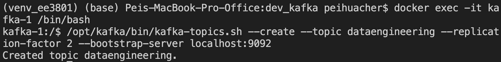
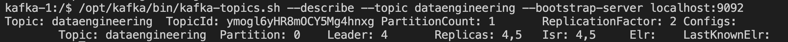
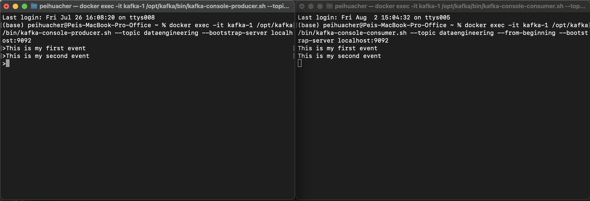

# Lab 9 Stream Data Pipeline I

- Scenario: Streaming audio - 
  Stream audio from a local device, process it, and save the data for reporting.
    1. Capture audio from local device and auto transcribe using OpenAI-Whisper
        - Save to device and transcribe
        - Stream and transcribe
    2. Install Kafka
    3. Send messages using Kafka
    

    Next week we will learn to stream audio and transcribe through Kafka.
------

Create a new Jupyter notebook file named `stream_data_pipeline_1.ipynb`.

```python
import os
home_directory = os.path.expanduser("~")
os.chdir(os.path.join(home_directory, 'Documents', 'projects', 'ee3801'))
```

# 1. Scenario: Streaming audio

The company wants to build an in-house automatic speech transcription tool. The system should stream audio from your device, transcribe it using OpenAI's Whisper model, and save the transcribed text for reporting.

# 1.1 Stream audio data auto-transcription

Measure the latency of a single audio stream transcription. Record how long it takes to read, write, and transcribe the audio. 

In Visual Studio Code stream_data_pipeline_1.ipynb file, install the appropriate python packages into the local machine.

```python
# Install required Python packages
# !pip install --upgrade pip

# For macOS users
# !brew install portaudio
# !python3 -m pip install pyaudio
# !python3 -m pip install scipy

# For Apple Silicon users
# !arch -arm64 /opt/homebrew/bin/brew install portaudio
# !python3 -m pip cache purge
# !python3 -m pip install pyaudio 
# !python3 -m pip install scipy

# For Windows users
# !python3 -m pip install sounddevice
# !python3 -m pip install pyaudio
# !python3 -m pip install scipy
```

# 1.1.1 Stream audio input

1. Check the default audio input device.

    ```python
    import pyaudio
    
    # Initialize PyAudio
    p = pyaudio.PyAudio()
    
    try:
        # Get information about the default input device
        default_input_device_info = p.get_default_input_device_info()
    
        # Print relevant information
        print("Default Input Microphone Information:")
        print(f"  Name: {default_input_device_info['name']}")
        print(f"  Index: {default_input_device_info['index']}")
        print(f"  Host API: {default_input_device_info['hostApi']}")
        print(f"  Max Input Channels: {default_input_device_info['maxInputChannels']}")
        print(f"  Default Sample Rate: {default_input_device_info['defaultSampleRate']}")
    
    except OSError as e:
        print(f"Error getting default input device info: {e}")
        print("This might happen if no default input device is available or properly configured.")
    
    finally:
        # Terminate PyAudio
        p.terminate()
    ```

2. List all audio devices on your machine.

    ```python
    # Testing audio setup in this device
    import pyaudio
    audio = pyaudio.PyAudio()
    print("audio.get_device_count():",audio.get_device_count())
    for i in range(audio.get_device_count()):
        print(audio.get_device_info_by_index(i))
    
    audio.terminate()
    ```

3. Choose the input and output devices, and note their index numbers. 

    This is to determine which input audio and output audio you will use. Explore and find the right index to use for input and output in your device.


    ```python
    import pyaudio

    audio = pyaudio.PyAudio()
    input_device = audio.get_default_input_device_info()
    print("Selected input audio:", input_device["name"])
    print("  maxInputChannels:", input_device["maxInputChannels"])
    print("  defaultSampleRate:", input_device["defaultSampleRate"])
    print("Selected output audio:", audio.get_device_info_by_index(2))
    audio.terminate()
    ```

    If no audio devices are listed, check your drivers and permissions.

    - macOS: Make sure the app has microphone permission in System Preferences -> Security & Privacy.
    - Windows: Confirm the microphone is enabled in Privacy Settings.
    ```python
    # for Windows
    import sounddevice as sd
    print(sd.query_devices())
    ```
    - Linux: Verify ALSA/PulseAudio settings.

# 1.1.2 Load whisper model once

1. Install OpenAI whisper\
    Refer to https://pypi.org/project/openai-whisper/ for more installation instructions.


    ```bash
    !python3 -m pip install -U jupyter
    !python3 -m pip install -U ipywidgets
    !python3 -m pip install -U openai-whisper
    # if you encounter errors, /tmp file might have limited storage size
    !python -m pip cache purge
    !mkdir -p ~/pip_tmp
    !TMPDIR=~/pip_tmp python -m pip install --no-cache-dir openai-whisper
    ```
    
    ```bash
    # python 3.11.5
    python -m pip install -U torch
    python -m pip uninstall numpy -y
    python -m pip install numpy==1.26.4
    # restart kernel
    ```

2. Load whisper model to transcribe audio to text.

    ```python
    import whisper
    model = whisper.load_model("medium.en") # tiny.en (if disk not enough space)
    ```

# 1.1.3 Read the script while recording

Read the passage below while recording audio. This helps you test transcription quality.

    - Producers are fairly straightforward: they send messages to a topic and partition, may request acknowledgments, may retry if a message fails, and then continue.

    - Consumers are more complex: they read messages from a topic, run in a poll loop that waits for new messages, and can start from the beginning of the topic to read the entire history. Once caught up, the consumer waits for new messages.

# 1.1.4 Capture one sentence

- Capture a short audio sentence, write audio to a file, read audio from the file, transcribe it, and optionally translate it.

- Install ffmpeg. Click <a href="https://ffmpeg.org/ffmpeg.html">here</a> to read more about ffmpeg.

    ```python
    ## If you see the error "No such file or directory: 'ffmpeg'", install ffmpeg for your platform.
    
    ## for macOS:
    # !brew install ffmpeg

    ## Windows (conda):
    # conda install -c conda-forge ffmpeg
    # # or
    # Get-ExecutionPolicy
    # Set-ExecutionPolicy Bypass -Scope Process
    # Set-ExecutionPolicy Bypass -Scope Process -Force; [System.Net.ServicePointManager]::SecurityProtocol = [System.Net.ServicePointManager]::SecurityProtocol -bot 3072; iex ((New-Object System.NetWebClient).DownloadString('https://chocolatey.org/install.ps1'))
    # choco install ffmpeg -y
    ```

    ## Using pyaudio (MacOS)

    Use this section if `pyaudio` is installed on your system.

    ```python
    # using pyaudio

    import pyaudio
    import wave
    import numpy as np
    from scipy.signal import resample

    WAVE_OUTPUT_FILENAME = "output.wav"

    def record_audio():
        FORMAT = pyaudio.paInt16
        CHUNK = 1024
        RECORD_SECONDS = 5
        WAVE_OUTPUT_FILENAME = "output.wav"
        # DEVICE_ID = 2  # Use a specific microphone if required.

        audio = pyaudio.PyAudio()
        input_device = audio.get_default_input_device_info()
        RATE = int(input_device['defaultSampleRate'])
        CHANNELS = int(input_device['maxInputChannels'])
        INDEX = int(input_device['index'])
        
        stream = audio.open(
            format=FORMAT,
            channels=CHANNELS,
            rate=RATE,
            input=True,
            frames_per_buffer=CHUNK
            # input_device_index=DEVICE_ID
        )

        frames = []

        for i in range(0, int(RATE / CHUNK * RECORD_SECONDS)):
            data = stream.read(CHUNK)
            frames.append(data)

        stream.stop_stream()
        stream.close()
        audio.terminate()

        waveFile = wave.open(WAVE_OUTPUT_FILENAME, 'wb')
        waveFile.setnchannels(CHANNELS)
        waveFile.setsampwidth(audio.get_sample_size(FORMAT))
        waveFile.setframerate(RATE)
        waveFile.writeframes(b''.join(frames))
        waveFile.close()

    # Capture audio once
    record_audio()

    audio = whisper.pad_or_trim(whisper.load_audio(WAVE_OUTPUT_FILENAME))  # "output.wav"
    print(whisper.transcribe(model, audio, fp16=False)["text"])
    ```

    ## Using sounddevice (Windows)

    Use this section if `sounddevice` is installed or if `pyaudio` is not available.

    ```python
    import sounddevice as sd  # for Windows or if `sounddevice` is preferred

    # Get default input device info
    device_info = sd.query_devices(kind='input')

    # Sample rate (as float)
    sample_rate = int(device_info['default_samplerate'])

    # Maximum number of input channels
    channels = int(device_info['max_input_channels'])

    print(f"Default Input Device: {device_info['name']}")
    print(f"Sample Rate: {sample_rate} Hz")
    print(f"Channels: {channels}")
    ```

    ```python
    import wave
    import numpy as np
    import sounddevice as sd  # for Windows or if `sounddevice` is preferred

    WAVE_OUTPUT_FILENAME = "output.wav"

    def record_audio():
        CHUNK = 1024
        RECORD_SECONDS = 5
        WAVE_OUTPUT_FILENAME = "output.wav"
        
        print("Recording...")
        device_info = sd.query_devices(kind='input')
        RATE = int(device_info['default_samplerate'])
        CHANNELS = int(device_info['max_input_channels'])

        audio = sd.rec(int(RECORD_SECONDS * RATE), samplerate=RATE, channels=CHANNELS, dtype='int16') 
        sd.wait()
        print("Recording complete.")

        with wave.open(WAVE_OUTPUT_FILENAME, 'wb') as wf:
            wf.setnchannels(CHANNELS)
            wf.setsampwidth(2)  # 2 bytes for int16
            wf.setframerate(RATE)
            wf.writeframes(audio.tobytes())

    # Capture audio once
    record_audio()

    read_audio = whisper.pad_or_trim(whisper.load_audio(WAVE_OUTPUT_FILENAME))  # "output.wav"
    print(whisper.transcribe(model, read_audio, fp16=False)["text"])
    ```


# 1.1.5 Capture a paragraph

- Record an audio for 1 minute, save the audio to a file, read audio, transcribe and display the transcription. Take note of the time taken.

    ```python
    from datetime import datetime
    import sys

    start_time = datetime.now()

    try:
        while True:
            before_time = datetime.now()
            record_audio()
            before_load_time = datetime.now()

            audio = whisper.pad_or_trim(whisper.load_audio(WAVE_OUTPUT_FILENAME))
            before_transcribe_time = datetime.now()

            print("transcribe:", whisper.transcribe(model, audio, fp16=False)["text"])
            before_transcribe_translate_time = datetime.now()
            print("transcribe and translate:", whisper.transcribe(model, audio, task="translate", fp16=False)["text"])
            after_transcribe_translate_time = datetime.now()

            print("record time taken:", before_load_time - before_time)
            print("load record time taken:", before_transcribe_time - before_load_time)
            print("transcribe time taken:", before_transcribe_translate_time - before_transcribe_time)
            print("transcribe translate time taken:", after_transcribe_translate_time - before_transcribe_translate_time)
            print("total time taken:", after_transcribe_translate_time - before_time)

            if (datetime.now() - start_time).seconds > 60:
                print("* Exit program after 1 min *")
                break
    except KeyboardInterrupt:
        print("Program terminated by user")
    ```

# 1.1.6 Record audio, transcribe, and translate

- Record audio continuously for 1 minute, directly transcribe it and observe the results. Observe the results and answer the question. Which method is faster 3.1.5 or 3.1.6? What type of applications do you think is more useful for 3.1.5 and 3.1.6? Submit your findings.

    ## Using pyaudio (MacOS)

    Use this section if `pyaudio` is installed on your system.

    ```python
    import pyaudio
    import wave
    import numpy as np
    from datetime import datetime
    import whisper
    import sys
    from scipy.signal import resample

    FORMAT = pyaudio.paInt16    # Use 16-bit integers for audio resolution
    CHUNK = 1024                # Number of audio frames to read at a single time
    RECORD_SECONDS = 5          # Length of each audio chunk to process

    audio = pyaudio.PyAudio()
    input_device = audio.get_default_input_device_info()
    RATE = int(input_device['defaultSampleRate'])
    CHANNELS = int(input_device['maxInputChannels'])
    INDEX = int(input_device['index'])

    start_time = datetime.now()

    # Open a single persistent connection to the microphone hardware
    stream = audio.open(
        format=FORMAT,
        channels=CHANNELS,
        rate=RATE,
        input=True,
        frames_per_buffer=CHUNK,
        input_device_index=INDEX
    )

    try:
        while True:
            before_time = datetime.now()
            frames = []
            # Loop enough times to gather exactly 5 seconds of audio data
            for i in range(0, int(RATE / CHUNK * RECORD_SECONDS)):
                # Read a raw chunk of audio data from the mic; ignore data overflows if processing is slow
                data = stream.read(CHUNK, exception_on_overflow=False)
                frames.append(data)
            # Combine the list of smaller binary chunks into one massive byte string
            raw_data = b''.join(frames)

            # Convert raw binary bytes into an array of numbers. 
            # Divide by 32768.0 to convert 16-bit integers (-32768 to 32767) into decimals between -1.0 and 1.0 (Required by Whisper).
            audio_data = np.frombuffer(raw_data, dtype=np.int16).astype(np.float32) / 32768.0

            # If the microphone records in Stereo/Multi-channel, combine them into Mono
            if CHANNELS > 1:
                # Reshape flat array into columns per channel, then average the channels together
                audio_data = audio_data.reshape(-1, CHANNELS).mean(axis=1)
            
            target_len = int(len(audio_data) * 16000 / RATE)    # Calculate how many total samples the audio array needs to be when changed to 16,000Hz
            audio_data = resample(audio_data, num=target_len)   # Downsample the audio array to 16,000Hz (Whisper models are specifically trained on 16kHz audio)
            audio_data = whisper.pad_or_trim(audio_data)        # Enforce Whisper's strict input rule: pad short audio or cut long audio to exactly 30 seconds

            before_transcribe_time = datetime.now()
            print(whisper.transcribe(model, audio_data, fp16=False)["text"]) # Run the audio through the Whisper AI model to extract text (fp16=False forces 32-bit floats for CPU compatibility)
            before_transcribe_translate_time = datetime.now()

            print("read time taken:", before_transcribe_time - before_time)
            print("transcribe time taken:", before_transcribe_translate_time - before_transcribe_time)

            if (datetime.now() - start_time).seconds > 60:
                print("* Exit program after 1 min *")
                break
    except KeyboardInterrupt:
        print("* Program terminated by user *")
    except Exception as e:
        print("Exception:", e)
    finally:
        # Safely release the microphone hardware resources back to the operating system
        if stream is not None:
            stream.stop_stream()
            stream.close()
        audio.terminate()
    ```


    ## Using sounddevice (Windows)

    Use this section if `sounddevice` is installed or if `pyaudio` is not available.

    ```python
    import sounddevice as sd

    import wave
    import numpy as np
    from datetime import datetime
    import whisper
    import sys
    from scipy.signal import resample
    import queue

    FORMAT = sd.default.dtype[0]
    RECORD_SECONDS = 5

    input_device = sd.query_devices(kind='input')
    RATE = int(input_device['default_samplerate'])
    CHUNK = int(RATE * RECORD_SECONDS)
    CHANNELS = int(input_device['max_input_channels'])
    INDEX = int(input_device['index'])

    audio_queue = queue.Queue()

    def audio_callback(indata, frames, time, status):
        if status:
            print(status, file=sys.stderr)
        audio_queue.put(indata.copy())

    start_time = datetime.now()

    # Open a non-blocking stream that continuously captures audio
    stream = sd.InputStream(
        samplerate = RATE,
        channels = CHANNELS, 
        dtype = FORMAT, 
        device = INDEX,
        callback = audio_callback,
        blocksize = CHUNK
    )

    try:
        with stream: # Automatically starts and cleans up the stream
            while True:
                before_time = datetime.now()
                
                # Wait until a full 5-second chunk is ready in the queue
                raw_audio = audio_queue.get()

                # Convert multi-channel (Stereo) to Mono
                if CHANNELS > 1:
                    audio_data = raw_audio.mean(axis=1)
                else:
                    audio_data = raw_audio.flatten()
                # Ensure the data type is float32 (sounddevice usually returns float32 by default)
                audio_data = audio_data.astype(np.float32)

                target_len = int(len(audio_data) * 16000 / RATE) # Calculate how many total samples the audio array needs to be when changed to 16,000Hz
                audio_data = resample(audio_data, num=target_len) # Downsample the audio array to 16,000Hz (Whisper models are specifically trained on 16kHz audio)
                audio_data = whisper.pad_or_trim(audio_data) # Enforce Whisper's strict input rule: pad short audio or cut long audio to exactly 30 seconds

                before_transcribe_time = datetime.now()
                print(whisper.transcribe(model, audio_data, fp16=False)["text"]) # Run the audio through the Whisper AI model to extract text (fp16=False forces 32-bit floats for CPU compatibility)
                before_transcribe_translate_time = datetime.now()

                print("read time taken:", before_transcribe_time - before_time)
                print("transcribe time taken:", before_transcribe_translate_time - before_transcribe_time)

                if (datetime.now() - start_time).seconds > 60:
                    print("* Exit program after 1 min *")
                    break
    except KeyboardInterrupt:
        print("* Program terminated by user *")
    except Exception as e:
        print("Exception:", e)
        
    ```

# 2. Install Kafka

1. SSH into the EC2 instance, change to the project directory, and create the Kafka folder.

    ```bash
    cd ~/Documents/projects/ee3801

    # for MacOS
    ssh -i "MyKeyPair.pem" ec2-user@<ip_address>
    # for Windows
    ssh -i ~/"MyKeyPair.pem" ec2-user@<ip_address>

    mkdir -p ./dev_kafka/data
    
    cd ~/dev_kafka
    ```

2. On the EC2 instance, download the Kafka Docker Compose file into the `dev_kafka` folder.

    ```bash
    curl -LfO 'https://github.com/apache/kafka/raw/refs/heads/trunk/docker/examples/docker-compose-files/cluster/isolated/plaintext/docker-compose.yml'
    ```

3. On the EC2 instance, open `docker-compose.yml` and confirm that it creates three Kafka brokers and three isolated controllers.

    ```bash
    vi docker-compose.yml
    ```

4. Replace `localhost` with `${PUBLIC_IP_ADDRESS}` in `docker-compose.yml`, then save the file using command `:wq`.

5. On the EC2 instance, replace the <ip_address> with EC2 instance ip address and start Kafka with Docker Compose with the command below. Press Ctrl+C to stop the foreground process and and start the dev_kafka docker containers (controllers first) in docker dashboard. 

    ```bash
    sudo service docker start
    # stop all containers
    docker stop $(docker ps -q)

    IMAGE=apache/kafka:latest PUBLIC_IP_ADDRESS=<ip_address> docker-compose up
    ```
    ```bash
    # Ctrl+C then execute this command
    # start all kafka containers
    docker start dev_kafka-controller-1-1 dev_kafka-controller-2-1 dev_kafka-controller-3-1 kafka-1 kafka-2 kafka-3
    
    ```


# 3. Sending messages between producer and consumer in Kafka

1. On the EC2 instance, access the `kafka-1` docker container and create a new topic. This will be the producer terminal.

    ```bash
    # access kafka-1
    docker exec -it kafka-1 /bin/bash
    ```

    Create the topic:

    ```bash
    /opt/kafka/bin/kafka-topics.sh --create --topic dataengineering --replication-factor 2 --bootstrap-server localhost:9092
    ```

    

    Show details of the new topic created. Then exit the terminal.
    ```bash
    # show created topic
    /opt/kafka/bin/kafka-topics.sh --describe --topic dataengineering --bootstrap-server localhost:9092
    # exit terminal
    exit
    ```

    

    Start the producer in this terminal:

    ```bash
    docker exec -it kafka-1 /opt/kafka/bin/kafka-console-producer.sh --topic dataengineering --bootstrap-server localhost:9092
    ```

2. Open a second terminal on your local machine and SSH into the EC2 instance again. Then attach to the `kafka-1` container for the consumer.

    Start the consumer to listen for producer messages:

    ```bash
    # for MacOS
    ssh -i "MyKeyPair.pem" ec2-user@<ip_address>
    # for Windows
    ssh -i ~/"MyKeyPair.pem" ec2-user@<ip_address>
    # start the second terminal
    docker exec -it kafka-1 /opt/kafka/bin/kafka-console-consumer.sh --topic dataengineering --from-beginning --bootstrap-server localhost:9092
    ```

3. In the producer terminal, type messages. The consumer terminal should display them.

    Example messages:

    ```text
    This is my first event
    This is my second event
    ```

    

    Ctr+C to exit the producer and consumer processes.

    Stop the EC2 instance in AWS Console.

4. After completing the steps above, answer the following questions in your notebook:

    - What is Apache Kafka?
    - What are some example use cases for Apache Kafka?

# Conclusion

1. You have successfully streamed audio data from your device and saved it to a file.
2. You have successfully streamed audio data and directly transcribed the audio to text.

**Questions to ponder**

1. What do you think is the difference between a batch data pipeline and a stream data pipeline?
2. What applications need to use a stream data pipeline?
<br>

# Submissions next Wed 9pm (21 Oct)  

Submit your notebook as a PDF. Save your notebook as HTML, open it in a browser, and print it to PDF. Include in your submission:

    Section 1.1.5.
    
    Section 1.1.6.

    Section 3 Step 4. 

    Answer the questions to ponder.

~ The End ~
